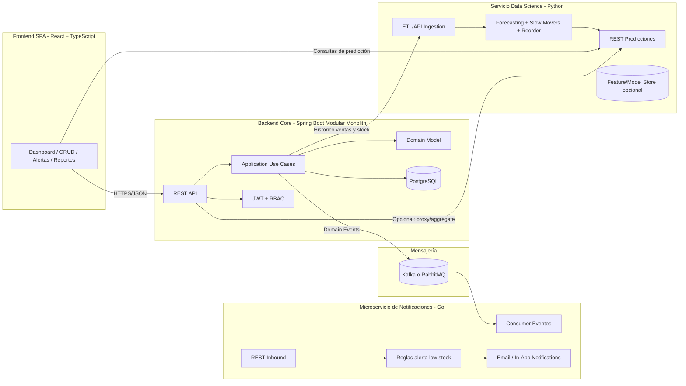
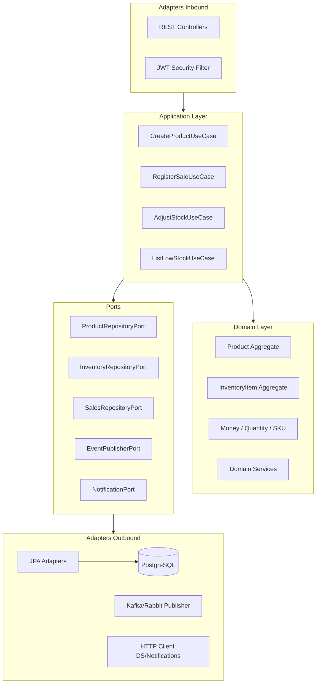
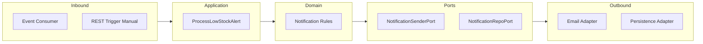
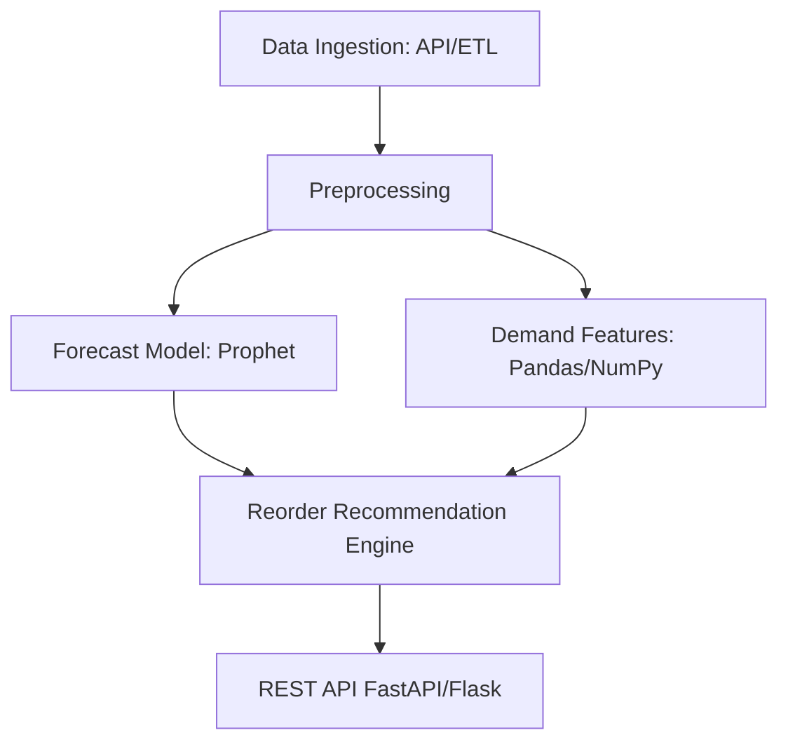
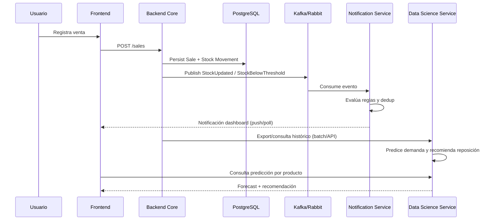

# Sistema de Inventario para Pequeños Negocios

## 1. Objetivo de diseño

Diseñar un sistema modular, mantenible y escalable para pequeñas empresas, con evolución natural hacia escenarios multi-sucursal y analítica avanzada, aplicando **Arquitectura Hexagonal (Ports & Adapters)** y **DDD ligero**.

---

## 2. Diagrama de arquitectura general



---

## 3. Bounded Contexts (DDD ligero)

### 3.1 Catálogo
- Gestión de productos
- Gestión de categorías
- Gestión de proveedores

### 3.2 Inventario
- Stock por producto
- Movimientos (entrada/salida/ajuste)
- Reglas de consistencia de inventario

### 3.3 Ventas
- Registro de ventas
- Descuento automático de stock
- Emisión de eventos de negocio

### 3.4 Identidad y Acceso
- Usuarios
- Roles (`ADMIN`, `VENDEDOR`, `ALMACEN`)
- Autorización de endpoints

### 3.5 Notificaciones (microservicio)
- Alertas de bajo stock
- Entrega asíncrona de notificaciones

### 3.6 Analytics (servicio Python)
- Forecast de demanda
- Detección de baja rotación
- Recomendación de reabastecimiento

---

## 4. Backend principal (Spring Boot + PostgreSQL) con Hexagonal pura

## 4.1 Hexágono (Core)



### 4.2 Estructura de carpetas sugerida

```text
backend-core/
  src/main/java/com/negocio/inventory/
    catalog/
      domain/
      application/
      ports/
      adapters/
    stock/
      domain/
      application/
      ports/
      adapters/
    sales/
      domain/
      application/
      ports/
      adapters/
    auth/
      domain/
      application/
      ports/
      adapters/
    shared/
      domain/
      application/
      infrastructure/
  src/main/resources/
    db/migration/
    application.yml
  src/test/
    unit/
    integration/
```

### 4.3 Entidades/agregados clave
- `Product` (Aggregate Root): `id`, `sku`, `name`, `categoryId`, `supplierId`, `active`
- `InventoryItem` (Aggregate Root): `productId`, `currentStock`, `minStock`, `reorderPoint`
- `StockMovement`: `type`, `quantity`, `reason`, `occurredAt`, `userId`
- `Sale`: `saleId`, `lines[]`, `total`, `createdAt`, `branchId`
- `User`: `email`, `passwordHash`, `roles[]`, `status`

### 4.4 Casos de uso representativos
- `CreateProductUseCase`
- `RegisterStockEntryUseCase`
- `RegisterSaleUseCase`
- `AdjustStockUseCase`
- `GetDashboardMetricsUseCase`
- `ListLowStockAlertsUseCase`

### 4.5 Endpoints REST clave (ejemplo)
- `POST /api/v1/products`
- `GET /api/v1/products?search=&categoryId=&active=`
- `POST /api/v1/inventory/movements`
- `GET /api/v1/inventory/{productId}`
- `GET /api/v1/inventory/alerts/low-stock`
- `POST /api/v1/sales`
- `GET /api/v1/sales?from=&to=`
- `POST /api/v1/auth/login`
- `GET /api/v1/dashboard/summary`

---

## 5. Microservicio independiente de notificaciones (Go)

## 5.1 Responsabilidades
- Consumir evento `StockBelowThreshold` desde Kafka/RabbitMQ.
- Aplicar reglas de priorización de alerta (criticidad, repetición, ventana de silencio).
- Notificar vía email y canal dashboard.

## 5.2 Hexagonal simplificada



### 5.3 Estructura sugerida

```text
notification-service/
  cmd/api/
  internal/
    domain/
    application/
    ports/
    adapters/
      messaging/
      rest/
      email/
      persistence/
  tests/
```

### 5.4 Endpoints clave
- `POST /internal/notifications/low-stock` (fallback manual)
- `GET /api/v1/notifications?status=&type=`
- `PATCH /api/v1/notifications/{id}/read`

---

## 6. Servicio de Data Science (Python)

## 6.1 Casos de uso analíticos
- Predicción de demanda por SKU (`7/14/30 días`).
- Detección de productos de baja rotación (`slow movers`).
- Recomendación de reposición usando `lead time`, `safety stock` y forecast.

## 6.2 Arquitectura del servicio



### 6.3 Estructura sugerida

```text
data-science-service/
  app/
    api/
    domain/
    services/
    repositories/
    models/
  notebooks/
  pipelines/
    training/
    batch_inference/
  tests/
```

### 6.4 Endpoints clave
- `GET /api/v1/predictions/demand?productId=&horizonDays=`
- `GET /api/v1/insights/slow-movers?from=&to=`
- `POST /api/v1/recommendations/reorder`

---

## 7. Frontend desacoplado (React + TypeScript)

## 7.1 Clean Frontend Architecture
- `domain`: tipos/entidades UI-agnostic.
- `application`: casos de uso frontend (orquestación de pantallas).
- `infrastructure`: cliente HTTP, auth storage, serializers.
- `presentation`: páginas, componentes, hooks.

### 7.2 Estructura sugerida

```text
frontend/
  src/
    domain/
    application/
    infrastructure/
      api/
      auth/
    presentation/
      pages/
      components/
      hooks/
      store/   # Redux Toolkit o Zustand
      routes/
  e2e/
```

### 7.3 Módulos UI
- Dashboard KPI (`stock total`, `quiebres`, `ventas diarias`).
- CRUD productos/categorías/proveedores.
- Panel de alertas low stock.
- Gráficas históricas + forecast.
- Gestión de usuarios y roles.

---

## 8. Flujo de datos end-to-end



---

## 9. Testing y calidad

### 9.1 Backend Core (Java)
- Unit tests de dominio (sin Spring).
- Integration tests de adaptadores JPA con Testcontainers.
- Contract tests para API REST.

### 9.2 Microservicio Go
- Unit tests de reglas de notificación.
- Integration tests de consumer de eventos.

### 9.3 Servicio DS Python
- Tests de feature engineering.
- Tests de estabilidad de métricas mínimas del modelo.
- Validación de drift básica.

### 9.4 Frontend
- Unit tests de componentes/hooks.
- E2E tests (Playwright/Cypress) para flujos críticos: login, venta, alerta.

### 9.5 Calidad transversal
- SOLID + principios de diseño hexagonal.
- Linters/formatters por stack.
- Análisis estático y coverage mínimo por servicio.

---

## 10. Estrategia de despliegue (Docker + CI/CD)

## 10.1 Contenedores
- `backend-core` (Spring Boot).
- `notification-service` (Go).
- `data-science-service` (Python API).
- `frontend` (Nginx + assets build).
- `postgres`, `kafka/rabbit`.

## 10.2 Entornos
- `dev`: docker-compose local con hot reload selectivo.
- `staging`: despliegue automático por rama principal.
- `prod`: despliegue gradual (blue/green o rolling).

## 10.3 Pipeline CI/CD mínimo
1. Lint + unit tests por servicio.
2. Integration tests.
3. Build imágenes Docker versionadas.
4. Scan de seguridad (dependencias + imagen).
5. Deploy a staging.
6. Smoke tests.
7. Aprobación y deploy a producción.

---

## 11. Roadmap evolutivo recomendado

### Fase 1 (MVP)
- Catálogo, stock, ventas, login JWT, alertas low stock básicas.

### Fase 2
- Dashboard analítico, notificaciones robustas, multi-sucursal simple.

### Fase 3
- Forecast productivo, recomendaciones automáticas y políticas de reposición por categoría.

### Fase 4
- Optimización avanzada (pricing/seasonality), observabilidad completa y escalado horizontal.

---

## 12. Decisiones clave de arquitectura

- **Monolito modular** para el core: acelera entrega inicial y minimiza complejidad operativa.
- **Microservicio de notificaciones desacoplado**: dominio naturalmente asíncrono y escalable.
- **Servicio DS separado**: ciclo de vida distinto (modelos, dependencias científicas).
- **Hexagonal en todos los servicios**: reduce acoplamiento a frameworks/DB.
- **Eventos de dominio + REST**: mezcla pragmática para negocio pequeño con crecimiento futuro.
